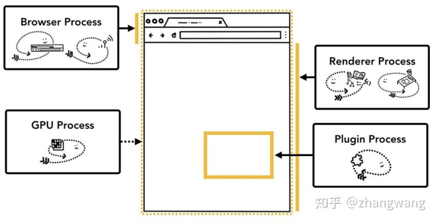

# 浏览器运行原理

  [参考文章:https://zhuanlan.zhihu.com/p/47407398](https://zhuanlan.zhihu.com/p/47407398)
  [参考文章:https://zhuanlan.zhihu.com/p/271859197](https://zhuanlan.zhihu.com/p/271859197)

  浏览器的每个页面就相当于一个进程
  以谷歌为例，
  首先谷歌有一个顶层的进程，负责协调其他进程之间的工作，他们之间通过IPC管道来通信，谷歌的 进程包括
  1. 谷歌顶层进程，负责协调各个进程的工作
  2. tab进程，谷歌中，每个tab就是一个单独的进程
  3. 插件管理进程
  4. gpu进程

  

  谷歌在67以上的版本中，同一个tab里面打开iframe 的时候，将会开启一个新的 进程来管理 iframe的页面。

## 一： 当用户输入一个url的时候发生了什么

  1. 解析url，拿到域名对应的dns
  2. 建立 tsl/ssl/tcp 连接
  3. 发送http请求
  4. 接受服务器响应结果
  5. 通过content-type判断资源类型
  6. 如果是html则渲染，是文件则下载，部分浏览器支持在线浏览 pdf和word
  7. 同时，浏览器更新 工具栏状态，比如(加载中的转圈，history 前进后退按钮等)

## 二： render process 是如何工作的

  首先，一个 render process 是包含多个线程的
  1. 主线程 main thread
  2. 工作线程 worker thread
  3. 排版线程 Compositor thread
  4. 光栅线程 Raster thread

  加载完 html之后，浏览器 渲染线程会处理 dom和css，生成dom tree和css rule tree，然后通过它们 生成 布局树，生成渲染树(render tree)之后，处理层，合并层，最后将层丢给gpu显示到屏幕上。
  值得一提的是，有些属性可以 指定将某元素看做单独的一层，交由gpu处理，合理的使用这一技巧，可以提高渲染性能。
  某些属性： 
  1. 3D效果， 旋转，变形(放大缩小)，transfrom位置便宜，
  2. will-change
  3. 透明(opacity)
  4. 滤镜(filters)

  dom tree 没有伪元素节点但是渲染树有，渲染树没有不显示的节点

## 回流和重绘

  通过构建渲染树计算元素在屏幕上的位置(layout)，每当页面的元素发生一些变化，导致需要重新计算位置的行为被称为回流(reflow)
  1. 元素尺寸的改变(替换了不同的图片或者内容文字长短，字号大小的改变等等)
  2. 窗口大小的改变
  3. 元素的新增和删除
  4. 元素的位置改变
  5. 在查询或者调用一些获取元素相关信息的时候 会导致 回流，页面为了尽可能的给到准确的信息，所以先回流一次在给出

## 重绘

  重新绘制

## 层

  主线程根据渲染树 生成 layer tree，然后给合成线程，合成线程会将层分区域，分区域后丢给gpu栅格化，栅格化完成之后合成线程会创建合成帧，
  合成帧创建完毕之后会通过管道(IPC)丢给浏览器进程，再由浏览器的渲染进程(render process)添加，然后丢给gpu，显示到屏幕上
  合成线程是个单独的线程，会调用gpu栅格，去拿光栅之后的数据 再做合并处理，合并处理之后形成帧，返回给主线程，主线程再把帧显示到屏幕上

## 如果有回流，那么回流发生在事件循环的什么阶段？
  js执行完毕之后，页面渲染之前

## 一定会有重绘和回流吗？
  不一定

## 从js的角度看待浏览器线程

  渲染线程
  js主线程
  事件触发线程
  定时器线程
  http请求线程

## 如果要做一期培训，讲浏览器打开页面，该讲那些内容？
  1.用户url - dns解析 - 建立 tcp 链接 - 发送http请求 - 拿到html
  2.拿到html之后浏览器解析dom并且 下载css和js
  3.解析html和css形成 dom tree 和 css rule tree
  4.生成render tree(有些也叫 layout tree)
  5.layout 分层(layers tree) - 切片 - 光栅化 - 合成线程
  6.生成合成帧，显示到页面上
  7.回流和重绘
  8.如何优化
  9.js侧看浏览器线程
